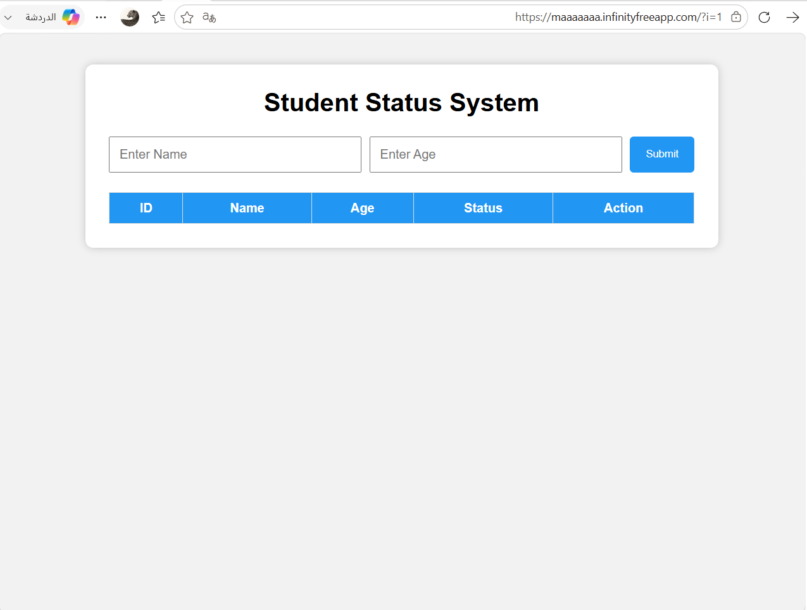
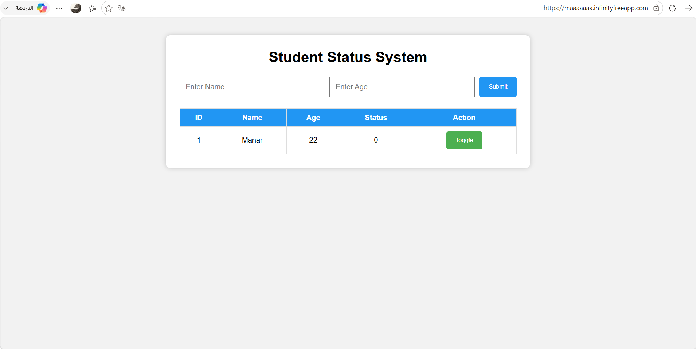
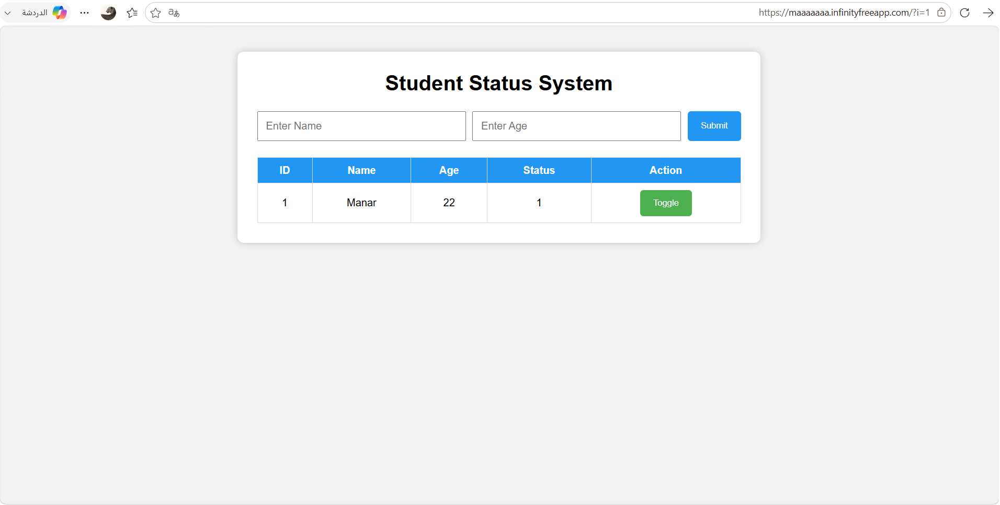

# StatusSync

A lightweight web application for managing student records with instant status updates.

## 📌 Project Overview
StatusSync is a simple student records management system that allows users to add student information, view records, and update student status instantly without refreshing the page.

This project demonstrates the use of PHP, MySQL, and JavaScript to create an interactive web application.

## ✨ Features
- Add new student records
- Display student information in a table
- Update student status instantly
- Store and manage data using MySQL database
- Simple and user-friendly interface

## 🛠️ Technologies Used
- HTML
- CSS
- JavaScript
- PHP
- MySQL

## 📂 Project Structure

```
index.php
db.php
insert.php
fetch.php
toggle.php
script.js
style.css

home-page.png
data-added.png
status-updated.png
toggle-demo.mp4
```
    
## ⚙️ How to Run
1. Install XAMPP or any local server environment.
2. Start Apache and MySQL services.
3. Create the required database using phpMyAdmin.
4. Place the project folder inside the `htdocs` directory.
5. Open the project through your browser.

## 📸 Screenshots
The project includes screenshots showing:

- **The initial interface**
  

  
- **Added student records**
  

  
- **Updated student status**
  



## 🎥 Demo Video

A short demonstration of the status update feature, showing how the status changes instantly without refreshing the page.

https://github.com/user-attachments/assets/ba839984-95eb-426d-9da2-fbeedd0427c4


## 👩‍💻 Author
Manar
